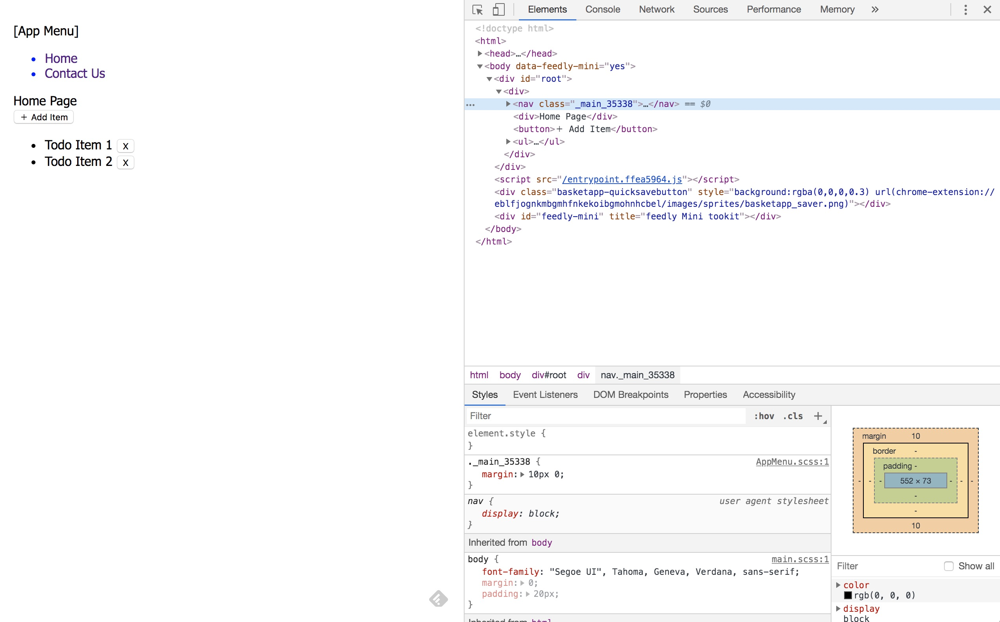

# 📦 Parcel UI

Parcel + Typescript + React + CSS Modules + SASS

### 🔧 Installation

Clone this project:
```
git clone https://github.com/ngduc/parcelui.git your-app
cd your-app
rm -rf .git
yarn
```
- Update `package.json` with your information.
- Run `yarn dev` then open http://localhost:1234/

### 🔧 Commands

```
yarn dev      launch DEV mode (tsc watch, auto reload)
yarn build    build for PROD to static directory ./dist
```

### CSS

- SCSS is recommended, but optional. You can also use ".css" files normally.

### Others

Recommend:
- VSCode & prettier addon

