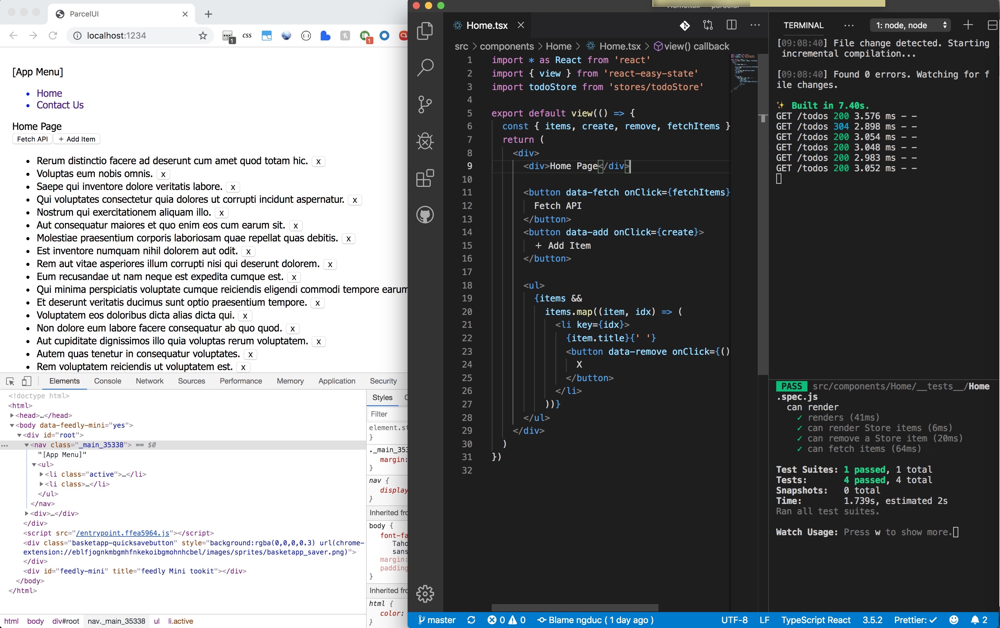

# 🚀 Parcel UI

[](https://travis-ci.org/ngduc/parcelui)

Parcel + Typescript + React/Preact + Router + CSS Modules + SASS + Jest + Api-Now + Github Actions CI

And more:

- Lazy loading (code splitting) for a page (Route).
- CSS scoping using CSS Modules: just import a local CSS or SASS file and use it.
- Store management with react-easy-state (easier than Redux, MobX).
- Component unit testing with Jest & Enzyme.
- Making Ajax requests using Whatwg-fetch Req with Mock APIs (json-server).
- Mock API server with [api-now](https://github.com/ngduc/api-now).

### 🔧 Installation

Clone this project:

```
git clone https://github.com/ngduc/parcelui.git your-app
cd your-app
rm -rf .git
yarn
```

- Update `package.json` with your information.
- Run `yarn dev` then open http://localhost:1234/

### ⚙️ Commands

```
yarn mock-api         launch mock API Server using https://github.com/ngduc/api-now

yarn dev              launch DEV mode takes 1.4s (tsc watch, parcel & mock-api)
yarn test:watch       run jest --watch (auto run test files)

yarn build            build for PROD to static directory ./dist
yarn serve            serve static built dir "./dist" using api-now (or any web server)
```

### CSS

- SCSS is recommended, but optional. You can also use ".css" files normally.

### Github Actions CI

- .github/workflows.ci.yml - build, deploy (vercel), cleanup.

### Others

Recommend:

- [React syntax](https://syntax.wiki)
- VSCode & prettier addon


